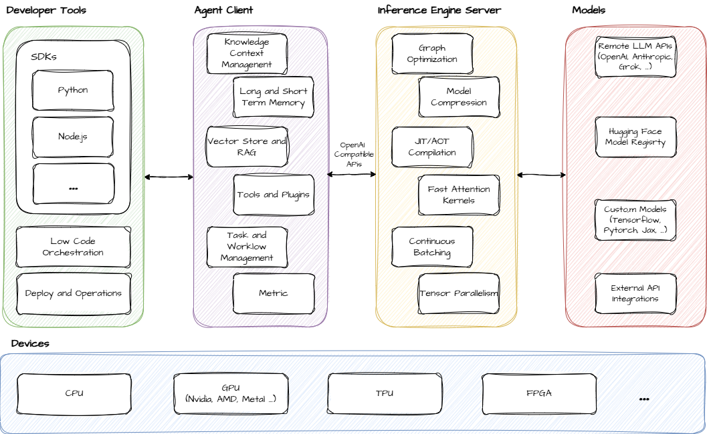

    

<h2 align="center">
Simple, Composable and High-Performance On-Chain AI Agents for Everyone
</h2>

## Introdution

Alith is an AI agent framework designed for the Web3 and Crypto, empowering developers to quickly build, deploy, and manage on-chain AI agents. By integrating blockchain technology, AI/ML models, and developer-friendly tools, Alith provides a modular and extensible platform that supports AI bots, multi-chain interactions, smart contract operations, real-time data processing, and high-performance inference. Whether you're building DeFi trading bots, NFT analyzers, or DAO governance tools, Alith offers robust support for your projects.

## Features

+ **Multiple Model Support**: Support for small models and large language models e.g., Llama, Grok, OpenAI, Anthropic, etc.
+ **Highly Extensible**: From covering internal prompts to accessing low-level APIs. Customize roles, goals, tools, actions and behaviors while maintaining a clean abstraction.
+ **Workflow Support**: Implementing any workflow pattern through processes - from simple sequential and hierarchical processes to complex custom orchestration patterns with conditional branching and parallel execution.
+ **Cross-Language Support**: Provides SDKs for Rust, Python and Node.js, making it easily accessible to different developers.
+ **High-Performance Inference**: Leverage the performance advantages of Rust and quick model inference technologies including graph optimization, model compression, JIT/AOT compilation with GPU coprocessors, etc.
+ **Fully On-Chain**: Verifiable and confidential AI agent based on EVM & WASM & Trusted Execution Environment (TEE) & Data Aggregation (DA).

## Architecture

    

## Contributing

We warmly welcome contributions to Alith! Whether you're a developer, a user reporting a bug, or someone eager to enhance our documentation, your participation is highly valued!
